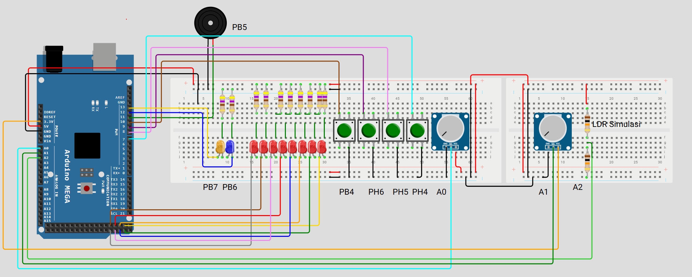
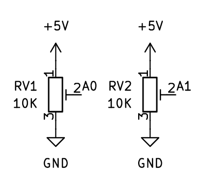
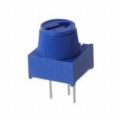
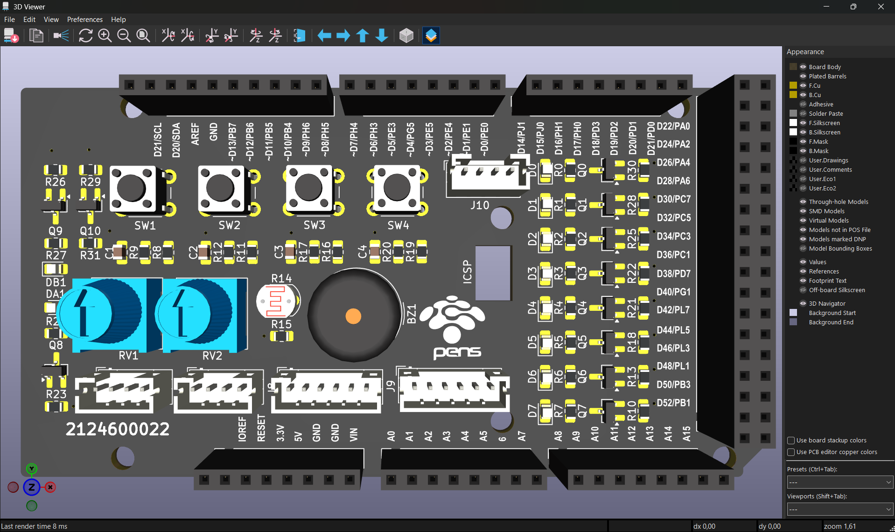
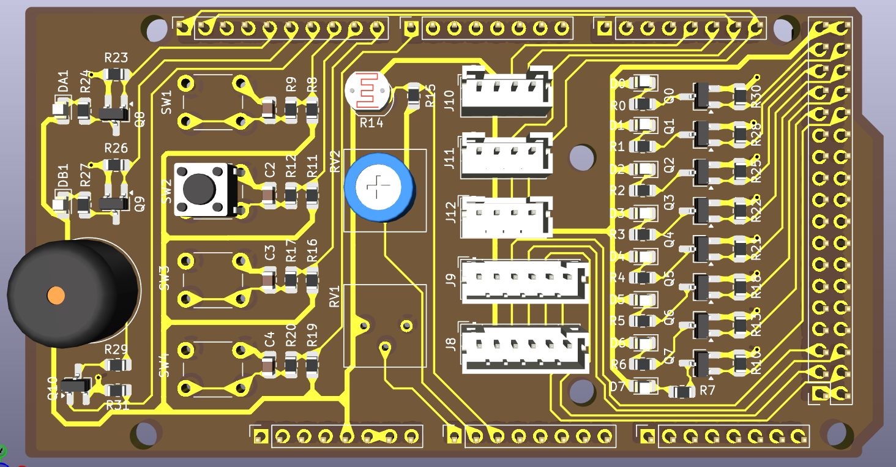

# 📋 Panduan Desain: Shield Arduino Mega 2560 — PENS Expansion Board V2.0



---

## 📐 Spesifikasi Teknis

### 1. Dimensi & Form Factor

| Parameter | Nilai |
|---|---|
| Panjang | 101.6 mm / 4000 mil (exact Arduino Mega R3) |
| Lebar | 53.3 mm / 2098 mil (exact Arduino Mega R3) |
| Ketebalan PCB | 1.6 mm / 63 mil (FR4) |
| Lubang mounting | 4× (diameter 3.2 mm / 126 mil) |
| Jumlah layer | 2 (dua layer) |
| Konektor ke Mega | *Stackable female header* 2.54 mm / 100 mil |

### 2. Sumber Daya

- **Source:** Arduino Mega 5V rail saja (tidak ada *external power*)
- **Decoupling:** 4× 100 nF (0805) — distribusi dekat cluster MOSFET untuk menjaga stabilitas switching

### 3. Pin Assignment (WAJIB SAMA DENGAN WOKWI)

> ⚠️ **PENTING:** Pin *assignment* harus persis sama dengan simulator Wokwi PENS Elka. Jangan merubah *mapping* pin karena akan menyebabkan kode tidak kompatibel antara simulator dan *hardware* fisik.

#### 3.1. LED Array (8 LED Merah — PORTA)

| Arduino Pin | AVR Port | Device | Warna | Reference |
|---|---|---|---|---|
| D22 | PA0 | LED1 | Merah | D0 |
| D23 | PA1 | LED8 | Merah | D1 |
| D24 | PA2 | LED7 | Merah | D2 |
| D25 | PA3 | LED5 | Merah | D3 |
| D26 | PA4 | LED3 | Merah | D4 |
| D27 | PA5 | LED6 | Merah | D5 |
| D28 | PA6 | LED4 | Merah | D6 |
| D29 | PA7 | LED2 | Merah | D7 |

**Package:** LED SMD 0805 (`LED_SMD:LED_0805_2012Metric_Pad1.15x1.40mm_HandSolder`)

**Tata letak PCB:** Susun LED dalam satu baris dari PA0 di kiri hingga PA7 di kanan agar mahasiswa bisa membaca *pattern* `PORTA` secara visual.

#### 3.2. LED Indikator (2 LED)

| Arduino Pin | AVR Port | Device | Warna | Reference |
|---|---|---|---|---|
| D12 | PB6 | LED9 | Merah | DA1 |
| D13 | PB7 | LED10 | Hijau | DB1 |

**Package:** LED SMD 0805 (sama dengan LED array)

#### 3.3. Buzzer

| Arduino Pin | AVR Port | Device | Reference |
|---|---|---|---|
| D11 | PB5 | Buzzer (piezo/magnetic 5V) | BZ1 |

**Skema rangkaian:**

```
        +5V
         │
       ┌─┴─┐
     1 │ + │ BZ1
       │   │ Buzzer
     2 │   │
       └─┬─┘
         │
       ┌─┴─┐
       │R6 │ 1K
       └─┬─┘
         │ 3
   D11 1 ┤├─┐
    ●────┤  │ Q2
    │    ┤├─┘ BSS138
  ┌─┴─┐    │ 2
  │R5 │    │
  │1M │    │
  └─┬─┘    │
    │      │
   GND    GND
```

#### 3.4. Push Button (Active-LOW, 4 unit)

| Arduino Pin | AVR Port | Device | Reference |
|---|---|---|---|
| D10 | PB4 | BTN1 | SW1 |
| D9 | PH6 | BTN2 | SW2 |
| D8 | PH5 | BTN3 | SW3 |
| D7 | PH4 | BTN4 | SW4 |

**Skema rangkaian (debounce):**

```
   +5V
    │
  ┌─┴─┐
  │R13│ 10K
  └─┬─┘
    ●──── D7
  ┌─┴─┐
  │R14│ 1K
  └─┬─┘
    ●─────────┐
   o│         │
   SW4       ─┴─ C4
   SW_Push   ─┬─ 0.1uF
   o│         │
    ●─────────┘
    │
   GND
```

- **Package:** Tactile switch 6×6 mm THT (`Button_Switch_THT:SW_PUSH_6mm`)
- **Tinggi actuator:** Rekomendasi 7.3H (ergonomis untuk jari, tidak mudah rusak)
- Tombol aktif saat ditekan (menghubungkan pin ke GND)
- Menggunakan internal pull-up AVR (`INPUT_PULLUP` di kode) — tidak perlu resistor pull-up eksternal
- **Alasan pilih THT (bukan SMD):** Untuk praktikum mahasiswa, THT jauh lebih robust terhadap tekanan berulang dan perlakuan kasar. Jalur PCB tidak mudah rusak karena kaki pin masuk ke PTH (plated through-hole), bukan hanya solder di permukaan.

#### 3.5. Potensiometer & LDR (Input Analog)





| Arduino Pin | ADC Channel | Device | Reference | Tipe |
|---|---|---|---|---|
| A0 | ADC0 | POT1 | RV1 | Trimpot 10K |
| A1 | ADC1 | POT2 | RV2 | Trimpot 10K |
| A2 | ADC2 | LDR | R14 | GL5528 (5mm) |

**Package:**

- **Trimpot:** `Potentiometer_THT:Potentiometer_Bourns_3386P_Vertical` (Bourns 3386P 10K)
- **LDR:** `OptoDevice:R_LDR_5.1x4.3mm_P3.4mm_Vertical` (GL5528, pitch 3.4mm)

**Konfigurasi:**

- **Trimpot (RV1, RV2):** Voltage divider standar — Pin 1 ke +5V, Pin 3 ke GND, wiper (Pin 2) ke ADC
- **LDR (R14):** Voltage divider dengan resistor partner 10K (R_LDR ke +5V, R_10K ke GND, tap ke ADC)

---

## 🔌 Rangkaian Driver (MOSFET Isolation)

### Skema Driver LED (diulang untuk 8 LED PORTA + 2 LED indikator + Buzzer = 11 channel)

```
        +5V
         │
        ─┴─
        \ / D7
        ─┬─ LED
         │
       ┌─┴─┐
       │R32│ 1K
       └─┬─┘
         │ 3
  D29  1 ┤├─┐
   ●─────┤  │ Q12
   │     ┤├─┘ BSS138
 ┌─┴─┐     │ 2
 │R31│     │
 │1M │     │
 └─┬─┘     │
   │       │
  GND     GND
```

### Komponen per Channel LED

| # | Komponen | Nilai | Package | Fungsi |
|---|---|---|---|---|
| 1 | MOSFET | BSS138 | SOT-23 | Switch utama |
| 2 | Resistor pull-up | 10 kΩ | 0805 | Gate bias ke +5V |
| 3 | Resistor pull-down | 1 MΩ | 0805 | Cegah *flicker* saat pin INPUT |
| 4 | Resistor LED | 1 kΩ | 0805 | Pembatas arus LED (~3 mA) |
| 5 | LED | Merah/Hijau | 0805 | Indikator visual |

### Perilaku Driver

| Kondisi Pin Arduino | Gate MOSFET | LED |
|---|---|---|
| HIGH (5V) | HIGH | ON |
| LOW (0V) | LOW | OFF |
| INPUT (floating) | LOW (via R 1M) | OFF (tidak *flicker*) |

---

## 🔗 Antarmuka Komunikasi

### 1. Header I2C (JST PH 2.0, 4-pin)

**Reference:** J10 (atau salah satu dari J10, J11, J12)
**Footprint:** `Connector_JST:JST_PH_B4B-PH-K_1x04_P2.00mm_Vertical`

| Pin | Nama | Koneksi |
|---|---|---|
| 1 | GND | GND |
| 2 | VCC | +5V |
| 3 | SDA | Arduino pin 20 |
| 4 | SCL | Arduino pin 21 |

> **Catatan I2C pull-up:** ATmega2560 memiliki internal pull-up untuk SDA/SCL. Untuk modul I2C 5V standard (OLED, sensor), internal pull-up cukup. Jika menggunakan modul yang butuh pull-up eksternal, tambahkan resistor 4.7K di sisi modul.

### 2. Header SPI (JST PH 2.0, 6-pin)

**Reference:** J8 atau J9
**Footprint:** `Connector_JST:JST_PH_B6B-PH-K_1x06_P2.00mm_Vertical`

| Pin | Nama | Koneksi |
|---|---|---|
| 1 | GND | GND |
| 2 | VCC | +5V |
| 3 | MOSI | Arduino pin 51 |
| 4 | MISO | Arduino pin 50 |
| 5 | SCK | Arduino pin 52 |
| 6 | CS | Arduino pin 53 |

### 3. Header UART (JST PH 2.0, 4-pin)

**Reference:** J11 atau J12
**Footprint:** `Connector_JST:JST_PH_B4B-PH-K_1x04_P2.00mm_Vertical`

| Pin | Nama | Koneksi |
|---|---|---|
| 1 | GND | GND |
| 2 | VCC | +5V |
| 3 | TX1 | Arduino pin 18 (Serial1 TX) |
| 4 | RX1 | Arduino pin 19 (Serial1 RX) |

> Menggunakan **Serial1** (bukan Serial0) agar USB *debug* tetap tersedia untuk *Serial Monitor*.

**Praktik desain:**

- *Expose* semua pin yang digunakan di sisi atas dan bawah *board*
- *Silkscreen* dual label: "D22 / PA0", "A0 / ADC0", dst.
- Termasuk multiple *access point* untuk +5V dan GND

---

## 🎨 Prioritas Layout PCB

1. LED array disusun horizontal dari kiri ke kanan: PA0 → PA7
2. Push button dikelompokkan (4 tombol dalam satu baris)
3. Input analog dikelompokkan (2 trimpot + 1 LDR dalam satu area)
4. Connector JST di tepi *board* untuk akses kabel yang mudah
5. Silkscreen dual label (Arduino pin + AVR port) pada setiap pin *breakout*
6. Component reference (R1, C1, Q1, dll.) terlihat setelah *assembly*
7. **LDR penempatan:** Jauhkan minimal 20mm dari LED indikator untuk menghindari cross-talk cahaya

---

## 🏭 Spesifikasi PCB & Manufacturing

### Spesifikasi Fisik

| Parameter | Nilai |
|---|---|
| Layer | 2 |
| Material | FR4 1.6 mm |
| Copper weight | 1 oz (35 µm) |
| *Soldermask* | Hitam atau ungu |
| *Silkscreen* | Putih |
| Surface finish | HASL Lead-free (gratis) |
| *Ground plane* | *Bottom layer* |
| *Top layer* | Signal + komponen |

### Layer Strategy

```
TOP layer:    Body semua komponen (SMD & THT)
              SMD solder pads di sini
              Signal trace + VCC

BOTTOM layer: Solder pad untuk pin THT (saja)
              Ground plane solid
              Minimize signal trace
```

**Prinsip desain:**

- ❌ Bottom layer **JANGAN** dijadikan VCC plane
- ✅ Bottom layer = **Ground plane solid** (lebih baik untuk EMI, signal integrity, dan ADC accuracy)
- ✅ VCC sebagai **trace tebal** di top layer (0.5 mm / 20 mil)
- ✅ Decoupling capacitor (100 nF) dekat dengan cluster MOSFET
- ✅ Stitching via di area ground pour (1 via per 1–2 cm²) untuk low-impedance ground

### Bonus

**Bonus (optional, nilai plus):** Tambahkan **logo PENS** dan/atau **tulisan "Prodi Elka"** di area kosong **Bottom Silkscreen (B.Silkscreen)** sebagai identitas board. Bisa dalam bentuk:

- Logo PENS (import image ke KiCad)
- Tulisan "Prodi Elka - PENS" dengan KiCad text tool
- Atau kombinasi keduanya

Contoh:

```
┌────────────────────────────────────┐
│                                    │
│           [Logo PENS]              │
│                                    │
│        PENS EXPANSION BOARD        │
│           V2.0 (2026)              │
│      Prodi Teknik Elektronika      │
│                                    │
└────────────────────────────────────┘
```

---

## 📏 Design Rules untuk JLCPCB (Safe Settings)

> ⚠️ **PENTING:** Design rules di bawah ini adalah **recommended safe values** — lebih besar dari JLCPCB minimum — untuk margin terhadap manufacturing tolerance. Jangan mendesain persis di JLCPCB minimum karena risiko reject atau defect tinggi.

### Design Rules Cheatsheet

```
┌──────────────────────────────────────────────────────┐
│  PCB DESIGN RULES (JLCPCB Safe Settings)             │
├──────────────────────────────────────────────────────┤
│                                                      │
│  TRACK WIDTH:                                        │
│    Signal:  0.25 mm  (10 mil)                        │
│    Power:   0.5  mm  (20 mil)                        │
│                                                      │
│  CLEARANCE:                                          │
│    Track – track:  0.2 mm  (8 mil)                   │
│    Track – pad:    0.2 mm  (8 mil)                   │
│    Track – edge:   0.3 mm  (12 mil)                  │
│                                                      │
│  VIA:                                                │
│    Signal:  0.3 / 0.6 mm  (12 / 24 mil)              │
│    Power:   0.4 / 0.8 mm  (16 / 32 mil)              │
│                                                      │
│  HOLE (THT):                                         │
│    Min drill:     0.3 mm  (12 mil) – JLCPCB limit    │
│    Typical pin:   0.6 – 1.0 mm  (24 – 39 mil)        │
│    Annular ring:  0.15 mm  (6 mil) per side          │
│                                                      │
│  BOARD EDGE:                                         │
│    Copper – edge:     0.3 mm  (12 mil)               │
│    Component – edge:  1.0 mm  (39 mil)               │
│    Mounting – edge:   2.0 mm  (79 mil)               │
│                                                      │
│  SILKSCREEN:                                         │
│    Line width:   0.15 mm  (6 mil)                    │
│    Text height:  1.0 mm  (39 mil)                    │
│    Pad clear:    0.15 mm  (6 mil)                    │
│                                                      │
│  UNIT CONVERSION:                                    │
│    1 mil = 0.0254 mm                                 │
│    1 mm  = 39.37 mil                                 │
│                                                      │
└──────────────────────────────────────────────────────┘
```

> 💡 **Tip praktis:** Biasakan mikir dalam mil untuk track width dan mm untuk board dimension — convention yang umum di komunitas PCB global. KiCad support keduanya, switch via View → Units atau shortcut Ctrl+U.

**Current capacity:** Trace 0.5 mm (20 mil) pada 1 oz copper = ~1.6 A (10°C rise). Estimasi beban project ini ≈ 300 mA (10 LED × 3 mA + buzzer 50 mA + modul external 200 mA), jadi margin ~5× — sangat aman.

### Clearance Komponen

**Clearance** = jarak minimum antara dua komponen di PCB, diukur dari body/pad komponen satu ke body/pad komponen sebelahnya.

```
[Komponen A] ←─── clearance ───→ [Komponen B]
   body                              body
```

| Antar Komponen | Recommended | Alasan |
|---|---|---|
| SMD 0805 – SMD 0805 | **0.5 mm (20 mil)** | Akses solder iron |
| BSS138 (SOT-23) – neighbor | **1.0 mm (39 mil)** | Akses untuk rework |
| LED 0805 – LED 0805 (array PORTA) | **1.0 mm (39 mil)** | Visual separation, tidak overlap cahaya |
| Tactile switch (THT) – neighbor | **3 mm (118 mil)** | Space untuk jari menekan |
| Trimpot 3386P – neighbor | **2 mm (79 mil)** | Akses obeng untuk adjust |
| **LDR – LED indikator** | **20–30 mm (787–1181 mil)** | Hindari cross-talk cahaya ke LDR |
| JST PH – tepi PCB | **5 mm (197 mil)** | Clearance kabel saat dicolok |

> Ini berbeda dengan trace clearance (jarak antar jalur tembaga). Clearance komponen lebih ke urusan fisik/mekanis, sedangkan trace clearance urusan elektris.

### Cara Set di KiCad

1. PCB Editor → **File → Board Setup**
2. Tab **Design Rules → Constraints** → input nilai Global Constraints
3. Tab **Design Rules → Net Classes** → tambahkan class "Power", assign net VCC dan GND
4. Save

**Verifikasi sebelum export:** Inspect → **Design Rules Checker (DRC)** → target **zero error**, warning silkscreen diperiksa manual.

---

## ✅ Checklist Sebelum Submit Gerber

### Phase 1: KiCad DRC

- [ ] DRC run dengan zero error
- [ ] Warning silkscreen sudah direview (silkscreen overlap pad akan auto-remove oleh JLCPCB)
- [ ] Tidak ada unconnected net

### Phase 2: Visual Review

- [ ] **3D View** (Alt+3) — semua komponen muncul & positioned benar
- [ ] **Ground plane** di bottom layer solid, tidak split oleh signal
- [ ] **Stitching via** di ground pour, kerapatan 1 per 1–2 cm²
- [ ] **Decoupling cap** (100 nF) dekat dengan cluster MOSFET
- [ ] **Silkscreen** label Arduino pin + AVR port readable
- [ ] **Reference designator** (R1, Q1, dll.) visible setelah assembly

### Phase 3: Mechanical Fit

- [ ] **Board outline** (Edge.Cuts) closed polygon, 101.6 × 53.3 mm
- [ ] **4 mounting hole** di lokasi exact Arduino Mega R3
- [ ] **Stackable pin header** align dengan Arduino Mega socket
- [ ] **Clearance barrel jack** + **USB connector** Mega
- [ ] Tinggi komponen < 15 mm (agar shield bisa di-stack)

### Phase 4: Print 1:1 Test

- [ ] Print PDF top + bottom layer 1:1 di kertas
- [ ] Verifikasi skala dengan penggaris
- [ ] Taruh komponen fisik di atas print
- [ ] Footprint match pad, orientasi benar
- [ ] Komponen THT tidak bentrok dengan komponen SMD sekitar

### Phase 5: Gerber Export & Review

- [ ] File → **Fabrication Outputs → Gerbers** → export semua layer
- [ ] **Generate drill files** (.drl) — centang!
- [ ] Upload zip ke **JLCPCB Gerber Viewer** (online)
- [ ] Visual inspection setiap layer (top copper, bottom copper, silkscreen, drill)
- [ ] Verifikasi board size di viewer

### Common Rejection Reasons dari JLCPCB

| Masalah | Solusi |
|---|---|
| Trace terlalu kecil (<6 mil) | Set min track width 0.2 mm (8 mil) |
| Hole <0.3 mm (12 mil) | Min drill 0.3 mm (12 mil) untuk via, 0.6 mm (24 mil) untuk pin THT |
| Trace terlalu dekat ke tepi PCB | Edge clearance minimum 0.3 mm (12 mil) — safer 0.5 mm (20 mil) |
| Silkscreen overlap pad | Kasih gap 0.15 mm (6 mil) (atau ikhlaskan auto-remove) |
| Missing drill file | Export .drl terpisah saat Gerber export |
| Board outline tidak closed | Edge.Cuts harus single closed polygon |

---

## 💪 Pro Tips dari Pengalaman Fabrikasi

### 1. Mulai DRC Lenient, Tighten Later

Saat awal routing, set DRC minimum (0.127 mm) biar KiCad router fleksibel. Setelah semua trace selesai, **tighten DRC** ke nilai recommended (0.2 mm) lalu re-run DRC. Fix error yang muncul satu per satu.

### 2. Jangan Mepet Manufacturing Minimum

JLCPCB minimum 0.127 mm, tapi desain di 0.2 mm. Manufacturing punya tolerance ±0.05 mm, kalau mepet minimum → kena tolerance minus → fail. Selalu kasih margin.

### 3. Test Points untuk Debugging

Tambahkan **test points** (pad TH 1 mm diameter) di signal kritikal untuk kemudahan debugging pasca-assembly:

| Signal | Lokasi Recommended |
|---|---|
| VCC 5V | Dekat power input header |
| GND | Multiple (minimum 3 lokasi di PCB) |
| Analog A0–A2 | Dekat trimpot/LDR |
| UART TX/RX | Dekat JST PH UART |
| SPI bus | Dekat JST PH SPI |
| Gate MOSFET | 1–2 channel sebagai sample (untuk scope) |

**Footprint:** `TestPoint:TestPoint_Pad_D1.5mm` atau `TestPoint_THTPad_1.0x1.0mm_Drill0.5mm`

### 4. Print 1:1 Manual Check

Sebelum klik "Submit" di JLCPCB:

1. Export PDF top + bottom layer dengan scale **1:1**
2. Print di kertas, verifikasi skala dengan penggaris (pastikan PCB 101.6 mm sesuai penggaris)
3. Taruh komponen fisik di atas cetakan
4. Cek alignment footprint, clearance, orientasi
5. Simulasi: tekan tombol, putar trimpot, colok JST — apakah ada yang bentrok?

**10 menit manual check = save $10 wasted PCB + 2 minggu waiting.**

### 5. Save Gerber sebagai "Release"

Setelah submit, **tag Gerber file** dengan versi (misal `ExpansionBoard-V1.0-Gerber.zip`) dan commit ke Git. Kalau nanti ada revisi, bisa compare version history.

---

## 📚 Referensi & Resources

### Datasheet Komponen Kritis

- BSS138 MOSFET Datasheet
- ATmega2560 (Arduino Mega) Datasheet
- JST PH Series Datasheet
- Bourns 3386P Potentiometer Datasheet
- LDR GL5528 Datasheet

### Tutorial & Learning

- KiCad Getting Started
- JLCPCB Ordering Guide

### Inspirasi Desain

- Cytron Maker Pi Pico Schematic — referensi MOSFET isolation topology
- Arduino Mega R3 Schematic

### Library KiCad

- SnapEDA Arduino Mega 2560 Rev3


## Release

Varian 1



- KICAD ->    [Kicad](KelasA\Kicad) 

- Gerver     ->  [PCB-gerber](KelasA\PCB-gerber) 

  

Varian 2



- KICAD ->   [KICAD](kelasB\KICAD) 

- Gerber ->  [PCB ELKA B-gerber.zip](kelasB\PCB ELKA B-gerber.zip) 

  

Pcloud

- https://e.pcloud.link/publink/show?code=kZzxKcZidlPBQnEcohYrJGMhkQTauFlQ4nX

## Test hardware

-  [test-hardware](test-hardware) 

